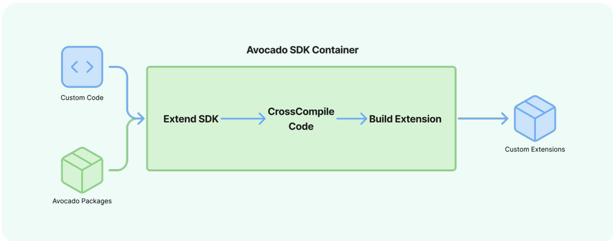

## Prerequisites

- Linux development machine (Ubuntu 22.04+, Fedora 39+)
- Podman or Docker
- 20GB+ available disk space
- Access to Avocado OS base images (online or pre-downloaded)

## Using Pre-built Components

Fetch pre-built base images and SDK containers:

```bash
# Pull SDK container
podman pull avocadolinux/sdk:apollo-edge

# Create a directory to save the SDK to
mkdir avocado

# Start development environment
cd avocado
podman run -it --rm -e AVOCADO_SDK_TARGET=qemux86-64 -v $(pwd):/opt:z --entrypoint entrypoint.sh avocadolinux/sdk:apollo-edge /bin/bash
```

## Supported Target Platforms

Set the `AVOCADO_SDK_TARGET` environment variable to one of the following available Avocado SDK targets when starting an SDK container:

**Arm**:
- `imx91-frdm`: NXP i.MX91 FRDM board
- `imx93-evk`: NXP i.MX93 EVK board
- `imx93-frdm`: NXP i.MX93 FRDM board
- `jetson-orin-nano-devkit-nvme`: NVIDIA Jetson Orin Nano
- `raspberrypi4`: Raspberry Pi 4
- `reterminal`: Seeed reTerminal

**x86**:
- `qemux86-64`: QEMU x86_64 virtualization

## Extension Image Build Pipeline


