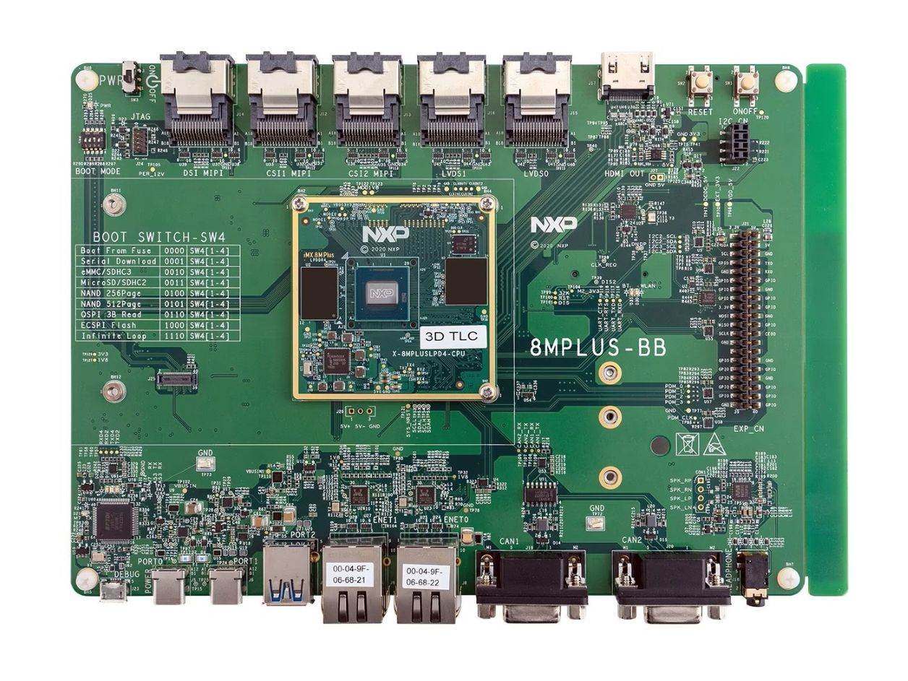

:::note[Current Status]

| Supported                     | SDK                                    | Provisioning    |
|-------------------------------|----------------------------------------|-----------------|
| 🟢 Target actively maintained | 🟢 x86-64 and aarch64 container images | 🟡 eMMC storage |

:::



The i.MX 8M Plus Evaluation Kit is a versatile development board built for rapid prototyping. It includes an on-chip NPU, enabling you to run machine learning workloads on the edge without taxing the CPU.

## 🛠 Technical Specifications

| Component        | Details                                                   |
|------------------|-----------------------------------------------------------|
| CPU              | Quad-core Arm Cortex-A53 (1.8 GHz)                        |
| MCU              | Single Arm Cortex-M7 (800 MHz)                            |
| NPU              | i.MX 8M Plus SoC integrated NPU                           |
| AI Performance   | Up to 2.3 TOPS (INT8)                                     |
| Memory           | 6GB 32-bit LPDDR4                                         |
| Memory Bandwidth | 12.8 GB/s                                                 |
| Storage          | 32GB eMMC                                                 |
| Connectivity     | Single M.2 Key E wireless module with Wi-Fi and Bluetooth |
| Power Modes      | 1.7W / 2W / 4W / 6W                                       |

## 🚀 Getting Started

Get up and running with the Avocado Linux SDK in minutes.

### Prerequisites

- Linux development machine (Ubuntu 22.04+, Fedora 39+)
- Docker installed
- 3GB+ available disk space

### Installing and running the SDK

1. Pull the SDK container:

```bash
docker pull avocadolinux/sdk:apollo-edge
```

2. Create your workspace:

```bash
mkdir avocado-imx8mp
cd avocado-imx8mp
```

3. Start the SDK environment:

```bash
docker run -it --rm -e \
  AVOCADO_SDK_TARGET=imx8mp-evk \
  -v $(pwd):/opt/_avocado/src:ro \
  -v $(pwd)/_avocado:/opt/_avocado:rw \
  --entrypoint entrypoint.sh \
  avocadolinux/sdk:apollo-edge /bin/bash
```

## ⚙️ Provisioning

We are actively working on a provisioning guide for the i.MX 8M Plus Evaluation Kit.

## 🧰 Hardware-in-the-Loop (HIL)

We are actively working on Hardware-in-the-Loop (HIL) development for the i.MX 8M Plus Evaluation Kit.

## 🧭 Target Roadmap/Known Limitations

🟡 NPU-accelerated ML inference is under development\
🟡 NPU-accelerated video pipelines are under development\
🟡 eMMC provisioning is under development\
🟡 Hardware-in-the-Loop (HIL) debugging is under development\
🟠 Secure boot is not yet supported\
🟠 Full disk encryption is not yet supported

