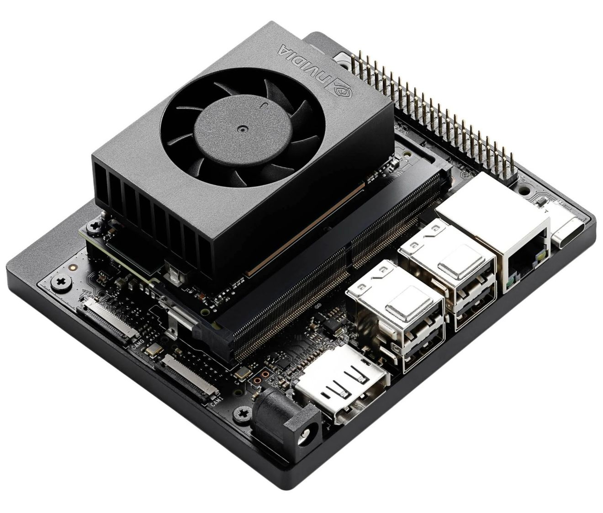

The Jetson Orin Nano delivers exceptional performance for real-time ML at the edge—up to 67 TOPS of AI compute. Paired with Avocado OS, you can deploy full inference pipelines in minutes, without the typical headaches of cross-compiling or system reboots.
Whether you're building computer vision, robotics, or edge AI applications, this target gets you production-ready fast.

## 🛠 Technical Specifications

| Component        | Details                                                    |
|------------------|------------------------------------------------------------|
| CPU              | 6-core Arm Cortex-A78AE v8.2 (1.7 GHz)                     |
| GPU              | NVIDIA Ampere GPU with 1024 CUDA cores and 32 tensor cores |
| AI Performance   | Up to 67 TOPS (INT8)                                       |
| Memory           | 8GB 128-bit LPDDR5                                         |
| Memory Bandwidth | 102 GB/s                                                   |
| Storage          | 2 x M.2 Key M slots for PCIe NVMe SSDs                     |
| Connectivity     | Single M.2 Key E wireless module with Wi-Fi and Bluetooth  |
| Power Modes      | 7W / 15W / 25W                                             | 

## 🚀 Getting Started

Get up and running with the Avocado Linux SDK in minutes.

### Prerequisites

- Linux development machine (Ubuntu 22.04+, Fedora 39+)
- docker installed
- 20GB+ available disk space

### Installing and running the SDK

1. Pull the SDK container:

```bash
docker pull avocadolinux/sdk:apollo-edge
```

2. Create your workspace:

```bash
mkdir avocado-jetson-orin-nano
cd avocado-jetson-orin-nano
```

3. Start the SDK environment:

```bash
docker run -it --rm -e AVOCADO_SDK_TARGET=jetson-orin-nano-devkit-nvme -v $(pwd):/opt/_avocado/src:ro -v $(pwd)/_avocado:/opt/_avocado:rw --entrypoint entrypoint.sh avocadolinux/sdk:apollo-edge /bin/bash
```

## ⚙️ Provisioning

The Jetson Orin Nano requires minimal provisioning to work with Avocado OS. There is *no need to reflash the OS*—we deploy via the bootloader and use the existing NVMe storage.

We are actively working on a provisioning guide for the Jetson Orin Nano.

## 🤖 Deploying ML Inference with Triton

With Avocado OS, you can deploy NVIDIA’s Triton Inference Server in just six commands—no cross-compiling or reflashing required.

Why it matters:
- Model updates apply *live*, without device reboots
- Works seamlessly with Avocado’s OTA update infrastructure
- Supports Hardware-in-the-Loop (HIL) testing workflows

## 🔍 Troubleshooting and Tips

Links to callout boxes on this page go here

## Target Roadmap/Known Limitations

🟢 GPU-accelerated ML inference is fully supported
🟡 GPU-accelerated video pipelines are under development
🟡 Hardware-in-the-Loop (HIL) debugging is under development
🔴 Secure boot is not yet supported
🔴 Full disk encryption is not yet supported

## Related Resources

- NVIDIA + Avocado OS Solution Overview (One-Pager)
- [Edge AI with Triton Inference Server](https://blog.peridio.com/nvidia-jetson-with-avocado-os)
