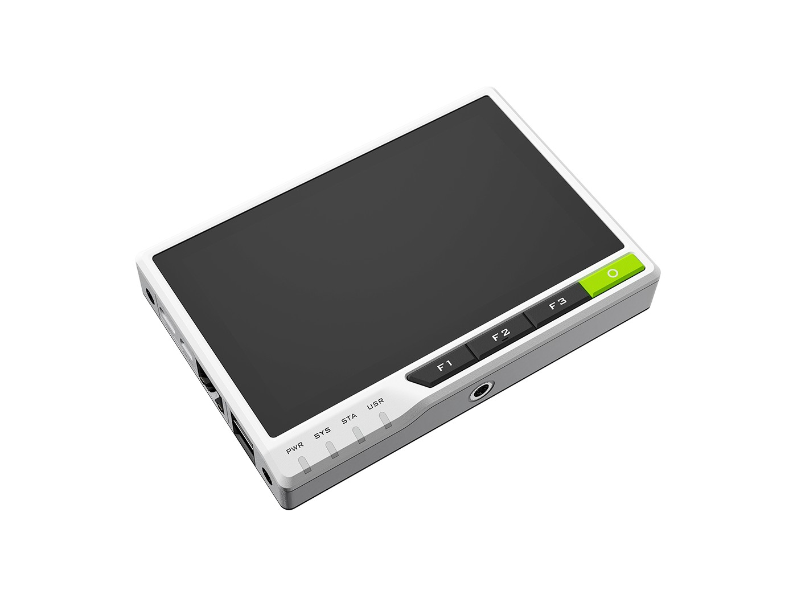

The Seeed reTerminal is a compact Human-Machine Interface (HMI) device that integrates a Raspberry Pi Compute Module 4 with a touchscreen display in a tablet-like form factor, designed for IoT, industrial automation, and edge AI applications.

## Technical Specifications

**Compute:**
- Quad-Core 64-bit Arm Cortex-A72 CPU at 1.5 GHz

**Memory & Storage:**
- 4GB LPDDR4-3200
- 32GB eMMC
- microSD card slot

**Wireless Connectivity:**
- Built-in Broadcom BCM43455 wireless module with Wi-Fi and Bluetooth

**Display:**
- 5-inch IPS capacitive multi-touch 720x1280 LCD screen 
- 293 PPI pixel density
