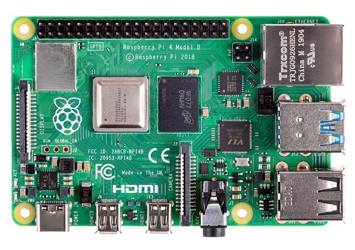

:::note[Current Status]

| Supported                     | SDK                                    | Provisioning            |
|-------------------------------|----------------------------------------|-------------------------|
| 🟢 Target actively maintained | 🟢 x86-64 and aarch64 container images | 🟡 microSD card storage |

:::



The Raspberry Pi 4 is the most popular single-board computer on the planet. Released in June 2019, it represents a major upgrade in processing power and memory capacity compared to earlier Raspberry Pi models.

## 🛠 Technical Specifications

| Component        | Details                                                    |
|------------------|------------------------------------------------------------|
| CPU              | Quad-core 64-bit Arm Cortex-A72 (1.8 GHz)                  |
| GPU              | Broadcom VideoCore VI (graphics only, not suitable for AI) |
| Memory           | 1GB, 2GB, 4GB, or 8GB LPDDR4-3200 variants                 |
| Memory Bandwidth | 8.5 GB/s                                                   |
| Storage          | microSD card slot                                          |
| Connectivity     | Broadcom BCM43455 wireless module with Wi-Fi and Bluetooth |
| Power Modes      | 3.5W / 5W / 6.5W / 8W                                        |

## 🚀 Getting Started

Get up and running with the Avocado Linux SDK in minutes.

### Prerequisites

- Linux development machine (Ubuntu 22.04+, Fedora 39+)
- Docker installed
- 3GB+ available disk space

### Installing and running the SDK

1. Pull the SDK container:

```bash
docker pull avocadolinux/sdk:apollo-edge
```

2. Create your workspace:

```bash
mkdir avocado-rpi4
cd avocado-rpi4
```

3. Start the SDK environment:

```bash
docker run -it --rm -e \
  AVOCADO_SDK_TARGET=raspberrypi4 \
  -v $(pwd):/opt/_avocado/src:ro \
  -v $(pwd)/_avocado:/opt/_avocado:rw \
  --entrypoint entrypoint.sh \
  avocadolinux/sdk:apollo-edge /bin/bash
```

## ⚙️ Provisioning

We are actively working on a provisioning guide for the Raspberry Pi 4.

## 🧰 Hardware-in-the-Loop (HIL)

We are actively working on Hardware-in-the-Loop (HIL) development for the Raspberry Pi 4.

## 🧭 Target Roadmap/Known Limitations

🟡 microSD card provisioning is under development\
🟡 Hardware-in-the-Loop (HIL) debugging is under development

