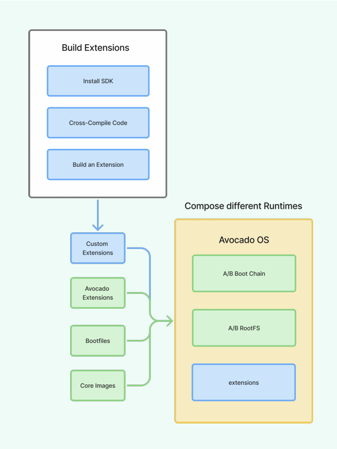

# Avocado OS SDK User Guide

This guide covers how to use the **Avocado SDK** containers and toolchains to build systemd extensions for Avocado OS targets.

## Table of Contents

1. [SDK Architecture](#sdk-architecture)
2. [Setting Up Development Environment](#setting-up-development-environment)
3. [Working with SDK Containers](#working-with-sdk-containers)
4. [Package Management](#package-management)
5. [Building System Extensions](#building-system-extensions)
6. [Building Configuration Extensions](#building-configuration-extensions)
7. [Creating Complete System Images](#creating-complete-system-images)
8. [Hardware-in-the-Loop Development](#hardware-in-the-loop-development)
9. [Advanced Workflows](#advanced-workflows)
10. [Troubleshooting](#troubleshooting)

## SDK Architecture

### Components

The Avocado SDK provides a containerized development environment consisting of:

**SDK Container**:
- Cross-compilation toolchains for target platforms
- Package management via DNF/RPM
- Extension building tools (squashfs-tools, btrfs-tools, genimage)
- Target sysroots for development

**Build Tools**:
- `avocado-repo`: Package installation and management
- `avocado-build`: Extension and image building
- `avocado-run-qemu`: QEMU testing (for supported targets)

### Architecture Overview



## Setting Up Development Environment

### Prerequisites

- Linux development machine (Ubuntu 22.04+, Fedora 39+)
- Podman or Docker
- 20GB+ available disk space
- Access to Avocado OS base images (online or pre-downloaded)

### Using Pre-built Components

Fetch pre-built base images and SDK containers:

```bash
# Pull SDK container
podman pull avocadolinux/sdk:latest

# Start development environment
docker run -it --rm avocadolinux/sdk:latest bash
```

### Supported Target Platforms

Available kas machine configurations:

```bash
# Arm-based targets
kas/machine/imx91-frdm.yml           # NXP i.MX91 FRDM board
kas/machine/imx93-evk.yml            # NXP i.MX93 EVK board  
kas/machine/imx93-frdm.yml           # NXP i.MX93 FRDM board
kas/machine/jetson-orin-nano-devkit-nvme.yml  # NVIDIA Jetson Orin Nano
kas/machine/raspberrypi4.yml         # Raspberry Pi 4
kas/machine/reterminal.yml           # Seeed reTerminal

# x86 targets  
kas/machine/qemux86-64.yml           # QEMU x86_64 virtualization
```

## Working with SDK Containers

### SDK Container Environment

When you enter the SDK container, several key environment variables are configured:

```bash
# SDK paths
AVOCADO_SDK_PREFIX="/opt/_avocado/sdk"
AVOCADO_SDK_SYSROOTS="/opt/_avocado/sdk/sysroots"

# Target information
AVOCADO_SDK_TARGET="qemux86-64"  # Or your selected target

# Cross-compilation environment (auto-configured)
CC="${TARGET_PREFIX}gcc"
CXX="${TARGET_PREFIX}g++"
# ... other toolchain variables
```

### Sysroot Structure

The SDK maintains several sysroots for different purposes:

```
/opt/_avocado/sdk/sysroots/
├── target-dev/          # Cross-compilation headers and libraries
├── rootfs/              # Base system packages (read-only reference)
├── sysext/              # System extension building area
├── confext/             # Configuration extension building area
└── var/                 # Var partition building area
```

### SDK Container Commands

**avocado-repo**: Package management
```bash
avocado-repo sdk <dnf-command>           # Manage SDK toolchain packages
avocado-repo target-dev <dnf-command>    # Manage development packages  
avocado-repo sysext <dnf-command>        # Manage extension packages
avocado-repo confext <dnf-command>       # Manage configuration packages
avocado-repo images                      # Download base system images
```

**avocado-build**: Building extensions and images
```bash
avocado-build sysext <name>              # Build system extension
avocado-build confext <name>             # Build configuration extension
avocado-build var                        # Build var partition
avocado-build image                      # Build complete system image
```

**avocado-run-qemu**: Testing (QEMU targets only)
```bash
avocado-run-qemu                         # Boot system in QEMU
```

## Package Management

### Understanding Package Types

**nativesdk packages**: Run on development host (in SDK)
- Cross-compilation toolchains
- Build tools (genimage, squashfs-tools)
- QEMU emulators
- Development utilities

**Target packages**: Run on target device
- Applications and libraries
- System services
- Runtime dependencies

**Development packages (-dev suffix)**: Headers and static libraries
- For cross-compilation
- Installed in `target-dev` sysroot
- Required to build applications that link against libraries

### Installing SDK Toolchain Components

```bash
# Install additional cross-compilation tools
avocado-repo sdk install nativesdk-cmake nativesdk-autotools

# Install QEMU for testing
avocado-repo sdk install nativesdk-qemu-system-x86_64

# Install development utilities
avocado-repo sdk install nativesdk-gdb nativesdk-strace
```

### Installing Development Dependencies

```bash
# Install development headers for cross-compilation
avocado-repo target-dev install openssl-dev libcurl-dev sqlite-dev

# Install Python development
avocado-repo target-dev install python3-dev
```

### Installing Extension Packages

```bash
# Install packages into sysext sysroot
avocado-repo sysext install nginx python3-flask supervisor

# Install system service
avocado-repo sysext install openssh-server
```

### Installing Configuration Packages

```bash
# Install certificate management
avocado-repo confext install ca-certificates

# Install environment-specific configs
avocado-repo confext install production-config
```

## Building System Extensions

### Understanding System Extensions

System extensions (sysext) extend the `/usr` and `/opt` hierarchies with:
- Application binaries (`/usr/bin`, `/usr/sbin`)
- Libraries (`/usr/lib`, `/usr/lib64`)
- Service definitions (`/usr/lib/systemd/system`)
- Application data (`/usr/share`)

### Basic Extension Building

```bash
# 1. Install packages into sysext sysroot
avocado-repo sysext install python3-flask

# 2. Build the extension
avocado-build sysext webserver

# Extension created at: /opt/_avocado/extensions/sysext/webserver.raw
```

### Advanced Extension Building

#### Custom Application Integration

```bash
# 1. Set up development environment
avocado-repo target-dev install libssl-dev libsqlite3-dev

# 2. Cross-compile your application
cd /opt/my-project
mkdir -p build && cd build

# Configure build (toolchain variables are pre-set)
cmake -DCMAKE_TOOLCHAIN_FILE=$CMAKE_TOOLCHAIN_FILE \
      -DCMAKE_INSTALL_PREFIX=/usr \
      ..

# Build
make -j$(nproc)

# 3. Install into sysext sysroot
make DESTDIR=$AVOCADO_SDK_SYSROOTS/sysext install

# 4. Add systemd service
mkdir -p $AVOCADO_SDK_SYSROOTS/sysext/usr/lib/systemd/system
cat > $AVOCADO_SDK_SYSROOTS/sysext/usr/lib/systemd/system/myapp.service << EOF
[Unit]
Description=My Application
After=network.target

[Service]
Type=simple
ExecStart=/usr/bin/myapp
Restart=always
User=myapp

[Install]
WantedBy=multi-user.target
EOF

# 5. Build extension
avocado-build sysext myapp
```

### Extension Verification

After building, extensions can be verified:

```bash
# Check extension structure
unsquashfs -l /opt/_avocado/extensions/sysext/webserver.raw

# Verify extension release file
unsquashfs -cat /opt/_avocado/extensions/sysext/webserver.raw usr/lib/extension-release.d/extension-release.webserver
```

## Building Configuration Extensions

### Understanding Configuration Extensions

Configuration extensions (confext) manage the `/etc` hierarchy:
- System configuration files (`/etc/nginx/`, `/etc/systemd/`)
- Environment-specific settings
- Certificates and keys
- Service overrides

### Basic Configuration Extension

```bash
# 1. Install configuration packages
avocado-repo confext install nginx-config production-certs

# 2. Add custom configuration
mkdir -p $AVOCADO_SDK_SYSROOTS/confext/etc/nginx/sites-available
cat > $AVOCADO_SDK_SYSROOTS/confext/etc/nginx/sites-available/myapp << EOF
server {
    listen 80;
    server_name myapp.local;
    
    location / {
        proxy_pass http://127.0.0.1:8080;
        proxy_set_header Host \$host;
        proxy_set_header X-Real-IP \$remote_addr;
    }
}
EOF

# 3. Build configuration extension
avocado-build confext production-nginx
```

### Environment-Specific Configurations

```bash
# Development configuration
mkdir -p $AVOCADO_SDK_SYSROOTS/confext/etc/myapp
cat > $AVOCADO_SDK_SYSROOTS/confext/etc/myapp/config.yaml << EOF
environment: development
debug: true
database_url: sqlite:///tmp/dev.db
log_level: debug
EOF

avocado-build confext dev-config

# Production configuration  
cat > $AVOCADO_SDK_SYSROOTS/confext/etc/myapp/config.yaml << EOF
environment: production
debug: false
database_url: postgresql://prod-db:5432/myapp
log_level: info
ssl_enabled: true
EOF

avocado-build confext prod-config
```

### Service Overrides

```bash
# Create systemd service override
mkdir -p $AVOCADO_SDK_SYSROOTS/confext/etc/systemd/system/myapp.service.d
cat > $AVOCADO_SDK_SYSROOTS/confext/etc/systemd/system/myapp.service.d/production.conf << EOF
[Service]
Environment=APP_ENV=production
Environment=LOG_LEVEL=info
MemoryMax=1G
CPUQuota=50%
EOF

avocado-build confext prod-overrides
```

## Creating Complete System Images

### Building Var Partition

The var partition contains extensions and is built separately:

```bash
# Build var partition with all current extensions
avocado-build var
```

This creates `/opt/_avocado/images/avocado-image-var.btrfs` containing:
- `lib/extensions/` - All built system extensions
- `lib/confexts/` - All built configuration extensions

### Building Complete System Image

```bash
# 1. Download base system images
avocado-repo images

# 2. Build complete system image
avocado-build image
```

This process:
1. Uses base rootfs and initramfs images
2. Includes the var partition with extensions
3. Creates bootable system image via genimage
4. Outputs complete image in `/opt/_avocado/output/`

### Image Components

For qemux86-64, the complete image includes:

```
avocado-image-qemux86-64.img
├── Boot partition (FAT32, EFI)
│   ├── systemd-boot (UEFI bootloader)
│   ├── vmlinuz (kernel)
│   └── initramfs.cpio.zst (initramfs)
├── Root partition (SquashFS, read-only)
│   └── avocado-image-rootfs-qemux86-64.rootfs.squashfs
└── Var partition (btrfs, read-write)
    └── avocado-image-var-qemux86-64.btrfs
```

## Hardware-in-the-Loop Development

### Live Development Setup

For iterative development on physical hardware:

```bash
# 1. Deploy base system to target device
# (Flash complete image to SD card/eMMC)

# 2. Set up NFS export from development machine
sudo mkdir -p /srv/nfs/extensions
sudo chown $(id -u):$(id -g) /srv/nfs/extensions
cp /opt/_avocado/extensions/sysext/*.raw /srv/nfs/extensions/

# 3. On target device, mount NFS share
mount -t nfs dev-machine:/srv/nfs/extensions /var/lib/extensions

# 4. Activate extensions
systemctl restart systemd-sysext

# Extensions are now active on target
```

### Remote Debugging

```bash
# Install GDB server on target (via extension)
avocado-repo sysext install gdbserver
avocado-build sysext debug-tools

# On target, start gdbserver
gdbserver :2345 /usr/bin/myapp

# In SDK container, connect with cross-gdb
avocado-repo sdk install nativesdk-gdb
$GDB /opt/_avocado/sysroots/target-dev/usr/bin/myapp
(gdb) target remote target-device:2345
```

### Performance Profiling

```bash
# Install profiling tools
avocado-repo sysext install perf strace valgrind
avocado-build sysext profiling-tools

# Profile on target
perf record -g /usr/bin/myapp
perf report --stdio > profile.txt

# Copy results back for analysis
scp target-device:profile.txt /opt/analysis/
```

## Advanced Workflows

### Building from Source

If you need to build Avocado OS components from source rather than using pre-built images:

```bash
# Clone repository
git clone --branch scarthgap https://github.com/avocado-os/meta-avocado.git
cd meta-avocado

# Build target platform (creates base images + packages)
source scripts/init-build kas/machine/qemux86-64.yml
kas build $KAS_YML

# Build SDK container
source scripts/init-build kas/sdk/container-x86_64.yml
kas build $KAS_YML

# Import SDK container
podman import build-container-x86_64/build/tmp/deploy/images/avocado-container-x86_64/avocado-image-container-avocado-container-x86_64.rootfs.tar.bz2 avocadolinux/sdk:dev

# Start development environment
export DEPLOY_DIR=$(pwd)/build-qemux86-64-secureboot/build/tmp/deploy
podman compose -f support/sdk-test/docker-compose.yml down --remove-orphans
podman compose -f support/sdk-test/docker-compose.yml run sdk /bin/bash
```

#### Build System Requirements

- **RAM**: 16GB+ recommended for builds
- **Storage**: 100GB+ for complete builds
- **CPU**: Multi-core recommended
- **OS**: Ubuntu 22.04+, Fedora 39+

#### Available Build Targets

- `avocado-core`: Base OS images and core SDK
- `avocado-complete`: Everything including extra packages
- Individual machines: `imx93-evk`, `jetson-orin-nano-devkit-nvme`, `raspberrypi4`, `qemux86-64`

### Multi-Target Development

```bash
# Build for multiple targets from same source
export DEPLOY_DIR_IMX93=../../build-imx93-evk/tmp/deploy
export DEPLOY_DIR_RPI4=../../build-raspberrypi4/tmp/deploy

# Start SDK for i.MX93
AVOCADO_SDK_TARGET=imx93-evk
