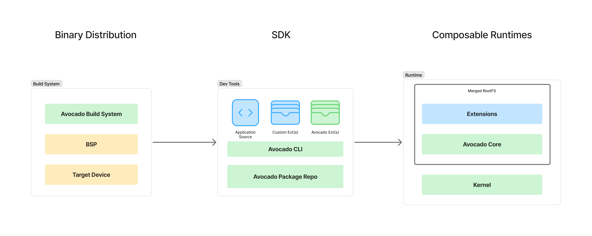

**Avocado OS** is a next-generation embedded Linux distribution that bridges the gap between rapid development and production-grade stability. Built and maintained by [Peridio](https://www.peridio.com/), Avocado OS rethinks how Linux systems are built, deployed, and maintained in modern products.

Whether you’re prototyping on a dev board or deploying to thousands of devices in the field, Avocado helps you move fast **without compromising on reliability, security, or maintainability.**

Avocado OS is 100% open source. It’s built to stand alone — and scales even further when paired with Peridio Fleet.

---

## What Makes Avocado OS Different?

### 🧩 Composable by Design
Instead of traditional monolithic builds, Avocado uses a **layered architecture**. Developers assemble systems using a small, immutable base and extend it with modular **system extensions**, **configuration overlays**, and **portable services**. This makes it simple to develop, test, and deploy without managing partitions or modifying core images.

### 🔐 Security Roadmap
Avocado has plans for:
- Secure Boot
- dm-verity for root filesystem integrity
- Full-disk encryption with LUKS
- Cryptographic identity for attestation and remote verification

These tools ensure that only verified software runs on your devices—from bootloader to user space.

### 🛠 Built with Yocto, Built to Scale
Avocado is fully based on the **Yocto Project**, making it highly customizable for your hardware while maintaining consistency across platforms. Whether you're targeting a single-board computer or a production SoC, Avocado provides a clean path from development to deployment.

### 🌱 Developer Experience Matters
With prebuilt layers, sensible defaults, and a vibrant extension ecosystem, Avocado takes the friction out of embedded Linux development. Developers can focus on building features—not wrestling with build systems.

---

## Join the Community

Avocado OS is an open-source project driven by its community. Join us to shape the future of embedded Linux:

- 💻 [GitHub](https://github.com/avocado-linux/meta-avocado)
- 💬 [Community Discord](https://discord.com/invite/rH77fKpKAj)
- 🥑 [Avocado Whitepaper](https://39718632.fs1.hubspotusercontent-na1.net/hubfs/39718632/Avocado%20OS%20Whitepaper.pdf)
---
